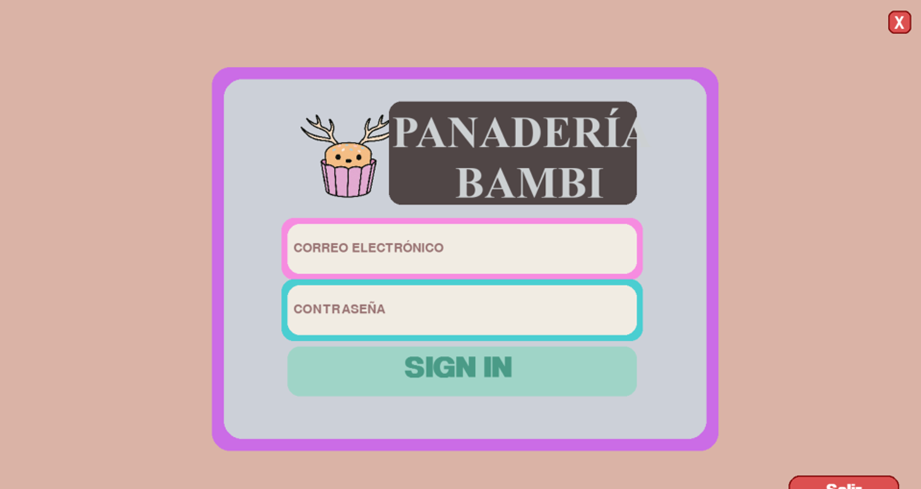

# Panadería Bambi


Esta aplicación permite el control de ventas con un curioso diseño de interfaz hecho en `pygame` , gestión de inventarios, análisis de datos de desempeño y administración general de la Panadería ficticia **Bambi** a través de un sistema de punto de venta amigable, eficiente y confiable. Es solo un proyecto escolar por lo que no pretende brindar funcionalidades reales de un sistema punto de venta.



**Módulo de Inicio de Sesión (Login)**

Este módulo permite el acceso seguro al sistema mediante credenciales personalizadas para cada usuario. El login valida el nombre de usuario y contraseña, permitiendo así controlar el acceso a las diferentes áreas de la aplicación. Se pueden gestionar niveles de acceso dependiendo del rol del empleado.

**Módulo de Ventas**

Este módulo permite realizar ventas de productos de manera rápida y eficiente. El sistema registra cada venta y, al finalizar, genera y guarda automáticamente un ticket de compra en formato PDF. Además, facilita la búsqueda de productos y la asignación de clientes a las ventas.

**Módulo de Almacén**

Este módulo muestra en tiempo real el inventario de insumos y materias primas disponibles en el almacén. Los usuarios pueden consultar cantidades actuales, realizar ajustes de stock y registrar nuevas entradas de productos para mantener actualizado el inventario.

**Módulo de Reportes**

Este módulo ofrece gráficos y reportes que permiten analizar el rendimiento de la panadería. Se pueden visualizar datos como las ventas realizadas durante la semana, los productos más vendidos (por ejemplo, qué tipos de pan), y los horarios de mayor venta. Esta información ayuda en la toma de decisiones estratégicas.

**Módulo de Ajustes**

Este módulo permite configurar aspectos esenciales de la aplicación, como cambiar el logo de la panadería, agregar nuevos empleados, registrar proveedores y clientes, así como modificar información general del sistema. Ofrece flexibilidad para adaptar el sistema a las necesidades de la empresa.

### **Dependencias**

- pygame
- tkinter
- mysql
- icecream
- smtplib
- requests
- reportlab
- fpdf
- BytesIO
- Image
- requests

### **Instrucciones**

Pasos para la instalación y configuración del sistema `Bambi`

1. Descargar y abrir el archivo `panaderia_bambi_setup_windows11x64.exe` en [relases](https://github.com/Kernel5110/bambito/releases/download/instalador/panaderia_bambi_setup_windows11x64.exe)
2. Aceptar ejecutar como administrador.

3. Marcar “Crear un acceso directo en el escritorio y dar siguiente”.

4. Indicar la ruta de instalación del sistema Bambi.

5. Presionar instalar.

6. Descargar el archivo bambi_dump.sql en el repositorio de Git Hub en la rama main desde la carpeta `db` en https://github.com/Kernel5110/bambito/tree/main/db.

7. Crear una base de datos llamada `bambi_db` en workbench (MySQL 8.0.) y cargar el script `bambi_dump.sql` en esa nueva base de datos.

```sql
use bambi_db
-- contenido de bambi_dump.sql...
```

8. En la ruta de instalación del sistema, por ejemplo `C:\Program Files\PanaderiaBambi`, abrir el archivo `credentials.json` e ingresar en el las credenciales de la base de datos previamente cargada ya sea usuario, base de datos, host, puerto y contraseña.

```json
{
  "host": "localhost",
  "user": "tu usuario",
  "password": "tu contraseña",
  "database": "bambi_db",
  "port": "tu puerto (generalmente 3036)"
}
```

9. Abrir el sistema Panaderia Bambi.

10. Ingresar la contraseña correcta.

11. Verificar que no haya espacios en blanco al inicio o final de los campos.

12. Pulsar el botón `Sign In`.

13. Esperar mientras el sistema valide las credenciales.

14. Observar la transición al menú principal
